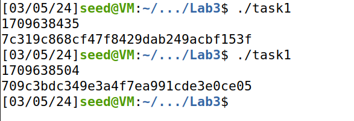
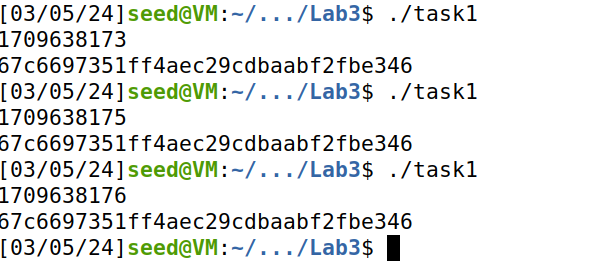
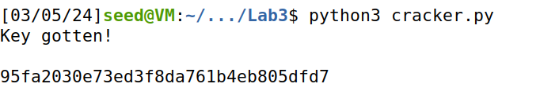
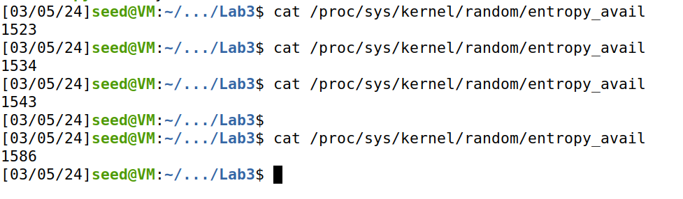
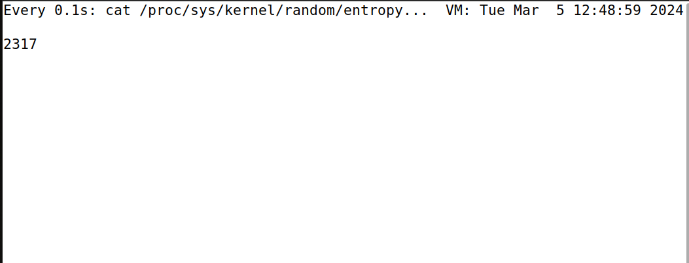
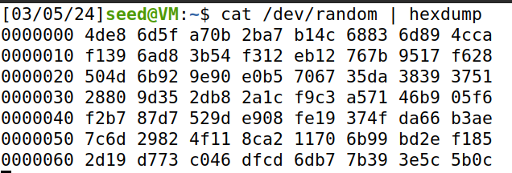
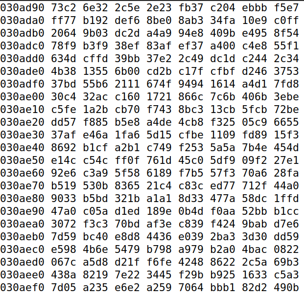
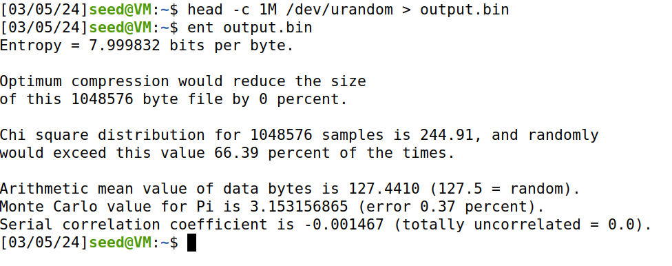
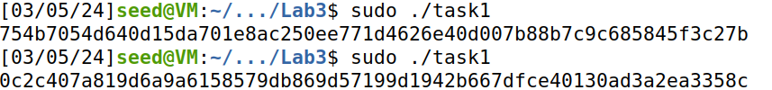

# Report 2: Pseudo Random Generation of Numbers

Generating random numbers is very important for cryptography. So, a computer who utilizes these techniques very often must have a robust and secure way of generating them. In this report we will explore a miriad of techiniques and see how secure an entropic they are.

## Task 1: Generating an Encription Key the Wrong Way

Firstly, we will generate an **Encryption key** the wrong way, and for that, we will use a program that uses the random library of c and the time to generate random numbers. The following is the program used:

```c
#include <stdio.h>
#include <stdlib.h>
#include <time.h>

#define KEYSIZE 16

void main()
{
    int i;
    char key[KEYSIZE];
    printf("%lld\n", (long long) time(NULL));
    srand (time(NULL)); 
    for (i = 0; i< KEYSIZE; i++){
        key[i] = rand()%256;
        printf("%.2x", (unsigned char)key[i]);
    }
    printf("\n");
}
``` 

The program generates a 128 bit char random **Encryption key** using srand and a seed.

As we can see, we generate the seed for the random function in the line **srand (time(NULL));**. We use the current time as the seed, and then in the line **key[i] = rand()%256;** we generate a number between 0 and 256 to add to the **Encryption key**.
**time(NULL)** returns the time in seconds elapsed from January 1, 1970 to now.
By running the program we generate the following keys:



If we remove the line defining the seed as the current time, the program uses the default seed for every execution, which is **1**. So the resulting **Encryption keys** are always the same, as we can see in the image bellow:



So, what is the problem with this way of doing it this way? Let us say that Alice generated an **Encryption key** using the program above between the date of **2018-04-17 21:08:49** and **2018-04-17 23:08:49** and used it to encrypt some very important documents. As we saw before, the program above uses time as a seed to generate the **Encryption key**, so, as we know the timeframe of the generation we can execute the program and obtain the same seed as Alice! We can then obtain her **Encryption key** and decrypt all her important files! We will now attempt to get Alice's documents.
Let us assume that the documents are in the **pdf** format. The document is encrypted using **AES**, which is a 128-bit cypher that uses blocks to encrypt and decrypt documents. A block consists of 16 bytes and so we will need 16 bytes of plaintext to decrypt it, so how do we get them?
But first we need to get Alice's **Encryption Key**, and so we need to generate every possible key in that 2 hour period and test againts some plain text we can find in the **pdf** file. We are lucky as we can get 16 bytes of the header of the files.
The beggining part of a **pdf** header is always the version number. At the time the file was created **PDF-1.5** was widely used so we now have 8 bytes of clear data in the form of the version number **%PDF-1.5**. The next 8 bytes are also quite easy to predict and so we now have 16 bytes of plain text. We compare the result to the encrypted data of those 16 bytes and see if it matches. The **plaintext** and **ciphertext** are bellow:

```sh
Plaintext: 255044462d312e350a25d0d4c5d80a34
Ciphertext: d06bf9d0dab8e8ef880660d2af65aa82
IV: 09080706050403020100A2B2C2D2E2F2
```
We also have access to the **Initial Vector(IV)** as it is never encrypted.
With all that done we can finally start the brute force attack using the following programs:

```c
#include <stdio.h>
#include <stdlib.h>
#include <time.h>

#define KEYSIZE 16

void main()
{
    int i;
    FILE* f1;
    f1 = open("enckeys.txt", "a+");

    for (i = 1524013729; i <= 1524020929; i++) {
        char key[KEYSIZE];
        printf("%lld\n", (long long) i);
        srand(i);

        int j;

        for (j = 0; j < KEYSIZE; j++) {
            key[j] = rand()%256;
            printf("%.2x", (unsigned char) key[j]);
            fprintf(f1, "%.2x", (unsigned char) key[j]);
        }
        fprintf(f1, "\n");
        printf("\n");
    }
}
``` 
This c program computes from every possible seed (the 2 hour window) starting in **1524013729** and ending in **1524020929**, computes every **Encryption Key** and saves it to the file **enckeys.txt**. 
Now with all the possible keys we can check which one is actually the right one. And for this we use the python script bellow:

```py
from Crypto.Cipher import AES

file = open("enckeys.txt", "r")

Lines = file.readlines()

for key in Lines:  
    aes = AES.new(bytearray.fromhex(key), AES.MODE_CBC, bytearray.fromhex("09080706050403020100A2B2C2D2E2F2"))
    data = aes.encrypt(bytearray.fromhex("255044462d312e350a25d0d4c5d80a34"))
    if data == bytearray.fromhex("d06bf9d0dab8e8ef880660d2af65aa82"):
        print("Key gotten!\n")
        print(key)
``` 
This python scrip imports the **AES** algorithm, gets all the keys from the **enckeys.txt** and creates an **AES** with each key and with the **IV** collected, it then encrypts our 16 bytes of plaintext and compares it with the equivalent cyphertext. If they are the same that means we found the actual key used in the encryption! We can see the python script execute in the image bellow:



So the Encryption Key is **95fa2030e73ed3f8da761b4eb805dfd7**! We found Alice's key and can now decrypt all her encrypted files.

## Task 2: Measure the Entropy

It is difficult for computers to create randomness. So most Operating Systems get their randomness from the physical world. Linux gets the randomness from these physical resources:

```c
void add_keyboard_randomness(unsigned char scancode);
void add_mouse_randomness(__u32 mouse_data);
void add_interrupt_randomness(int irq);
void add_blkdev_randomness(int major);
``` 
The **OS** is using the timing between keypresses to generate random numbers, the movement of the mouse and interrupt timing, the interrupt timing of the disk and finally the finish time of block device requests.
But how can we judge the quality of the randomness? We can do it with **Entropy**, it measures how many bits of random numbers the system has. In Linux you can check the system's entropy in the file **/proc/sys/kernel/random/entropy_avail**. We can check it by doing the following command:

```sh
$ cat /proc/sys/kernel/random/entropy_avail
``` 
This command returns the number of bytes of entropy available for random number generation, we can see how many we have in the image bellow:



As we can see, we have arround 1500 bytes of entropy available. But, as stated before, the levels of entropy can be raised by using the keyboard, mouse and other methods. By executing the following command we can check how the number of bytes change by using the keyboard and mouse.

```sh
$ watch -n .1 cat /proc/sys/kernel/random/entropy_avail
``` 
The command checks the changes in the **/proc/sys/kernel/random/entropy_avail** file every 0.1 seconds. We can see in the image bellow that after we move the mouse and press some keys the entropy value increases.



Through this expirement we can see how the system obtains a reliable source of entropy to generate resilient pseudo random numbers.

## Task 3: Get Pseudo Random Numbers From /dev/random

Linux uses two devices to use the physical numbers collected by **/proc/sys/kernel/random/entropy_avail**. Those two being **/dev/random** and **/dev/urandom**. They behave diffently, as **/dev/random** blocks and does not generate any number when the **/proc/sys/kernel/random/entropy_avail** has 0 bytes of collected data. **/dev/random** will only resume operation when it finds that the physical data is enough for generating pseudo random numbers.
We can see the behaviour of the **/dev/random/** by executing the command:
```sh
$ cat /dev/random | hexdump
``` 
**Hexdump** makes the output more understandable. When we run the output we see the following:



When we execute the watch on **cat /proc/sys/kernel/random/entropy_avail** and see the entropy increas, we also see that more lines are added to **/dev/random** until it goes to 0. When enough bytes are collected another entry is made on **/dev/random** and the entropy goes back to 0 again. We can see the blocking behaviour here, as entries are only made when there are enough bytes collected.
**/dev/random** should be used in limited amounts because of this blocking behaviour. For example, if we use **/dev/random** in a server to generate random session keys we can cause a **DOS**. If the number of clients is greater than the number of lines in **/dev/random** has and can produce, the server will block waiting for the entropy and the clients are left waiting. This can then constitutes a **DOS**. A malicius attacker can also send many false client requests and can bring the server down to legitimate clients. 

## Task 4: Get Pseudo Random Numbers From /dev/urandom

Linux also provides another device for pseudo random numbers and that is the **/dev/urandom**. The difference to **/dev/random** is that it will not block when the entropy in **/proc/sys/kernel/random/entropy_avail** is 0. **/dev/urandom** uses the data pooled to create a seed for its random number generation. 
Let us see the behaviour of **/dev/urandom** by, once again, executing the following command:

```sh
$ cat /dev/urandom | hexdump
``` 



Immediatly we see that it generates numbers non-stop, as it is non blocking, when the entropy runs out it starts using the pool instead. But are the results any good? We can check their quality using a tool called **ENT**, it analyses the numbers generated in a miriad of tests. Let's test 1 MB of the pseudo numbers generated by **/dev/urandom**. To test the 1 MB we will use the following commands:

```sh
$ head -c 1M /dev/urandom > output.bin
$ ent output.bin
``` 

The first command generates 1 MB of data and saves it to **output.bin**. The second tests it using **ENT**. The following image shows the results:



The test shows that the results are quite good! They are not totally random but are very close as we can see in the **arithmetic mean value**, **monte carlo** and **serial correlation coeficient**. They are close to the best value possible. 
In theory, **/dev/random** is more secure as it gets the best results but, for practical applications, we use **/dev/urandom** as the blocking penalty is very costly because it causes **Denial of Service**. 
So, using what we learned, let's modify the program that generates **Encryption Keys** using **/dev/urandom**. The following is the modified code:

```c
#include <stdio.h>
#include <stdlib.h>

#define KEYSIZE 32

void main()
{
    int i;
    unsigned char* key = (unsigned char *) malloc(sizeof(unsigned char) * KEYSIZE);
    FILE* random = fopen("/dev/urandom", "r");

    fread(key, sizeof(unsigned char) * KEYSIZE,1 , random);
    fclose(random);

    for (i = 0; i < KEYSIZE; i++) {
        printf(".2x", (unsigned char) key[i]);
    }

    printf("\n");
}
``` 
The script uses **/dev/urandom** to generate a 256-bit Encryption Key. It accesses the device and reads 32 bytes of data. This way the **Encryption key** is resilient to bruteforce attacks of the type used before due to using a pseudo random number and not a predictable seed. We can see the key generated in the following image:



### Authored by:
    Eduardo Ramos, up201906732
    Leandro Silva, up202008061
    Luís Paiva, up202006094


