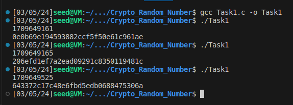
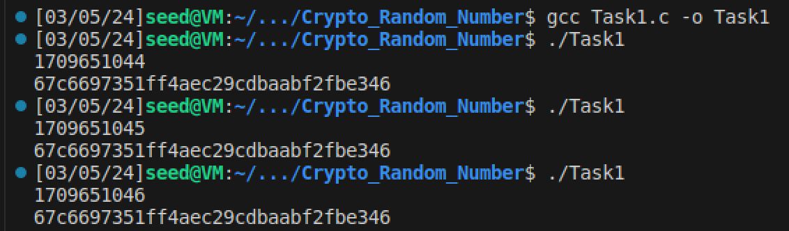

# Report 3: Pseudo Random Number Generation Lab

## Task 1: Generate Encryption Key in a Wrong Way

As a starting point, it is essential to start with a source of randomness, otherwise, the result would be predictable.
We use the **current time** to seed the pseudo-random number generator. The program is:

```c
#include <stdio.h>
#include <stdlib.h>
#include <time.h>

#define KEYSIZE 16

void main()
{
    int i;
    char key[KEYSIZE];

    printf("%lld\n", (long long) time(NULL));
    srand (time(NULL));
    
    for (i = 0; i< KEYSIZE; i++){
        key[i] = rand()%256;
        printf("%.2x", (unsigned char)key[i]);
    }
    printf("\n");
}
```
As seen bellow, executing the program several times always give a different result.



Now we comment the line **srand(time(NULL))** and we can note that the generated random number remains unchanged in every run.



The program utilizes the **srand(time(NULL))** function to seed the pseudo-random number generator with the current time, ensuring a different seed value on each execution. This leads to varied sequences of random numbers being generated. 

On the other side, when the seeding mechanism is commented out, the program defaults to a constant seed value, resulting in the same sequence of random numbers being produced with each program execution.
